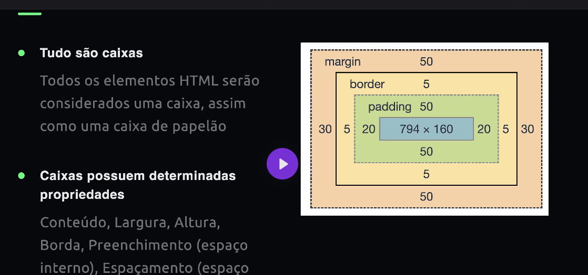
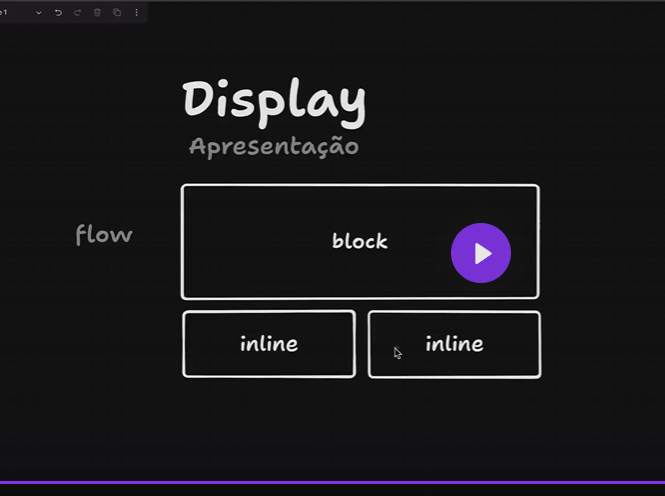

Tudo serão caixas.
Todos os elementos HTML serão considerados uma caixa.

Caixas possuem determinadas propriedades
Conteúdo, Largura, Altura, Borda, Preenchimento (espaço interno), Espaçamento (espaço externo)

#padding = preenchimento

Quando uma tag é blog, ela vai ocupar a linha toda
E quando ela é inline vai ficar uma no lado da outra.

