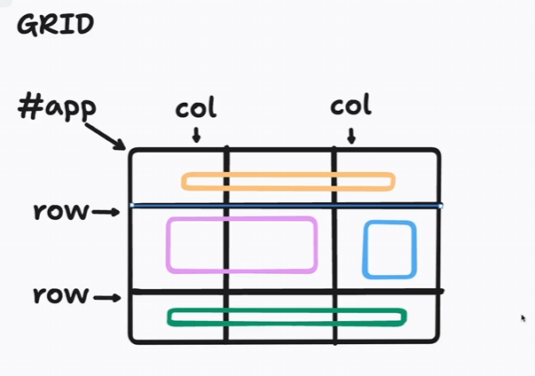

Grid:

## PROPRIEDADES FUNDAMENTAIS

Todo grid é composto de 2 principais grupos:
`container(box/caixa): o pai` e `itens: o(s) filhos`

DIV: Block-Level element
SPAN: Inline-Level element

---
### CONTAINER (pai)

- display: grid;
- gird-template; 
  - grid-template-columns;
  - grid-template-rows;
  - grid-template-areas;

### ITEMS (filhos)

- grid-column;
  - grid-column-start;
  - grid-column-end;
- grid-row;
  - grid-row-start;
  - grid-row-end;

### PROPRIEDADES DE ALINHAMENTO

Existem 9 propriedades fundamentais

**6 aplicadas em container**
`aling-content`
`justify-content`
`place-content`

`align-items`
`justify-items`
`place-items`

**3 aplicadas em items**
`align-self`
`justify-self`
`place-self`

Então podemos separar em 3 grupos:
`align`, `justify`, `place`

E cada um deles irá observar o
- conteúdo do elemento `content`
- itens do elemento `items`
- o próprio elemento `self`

