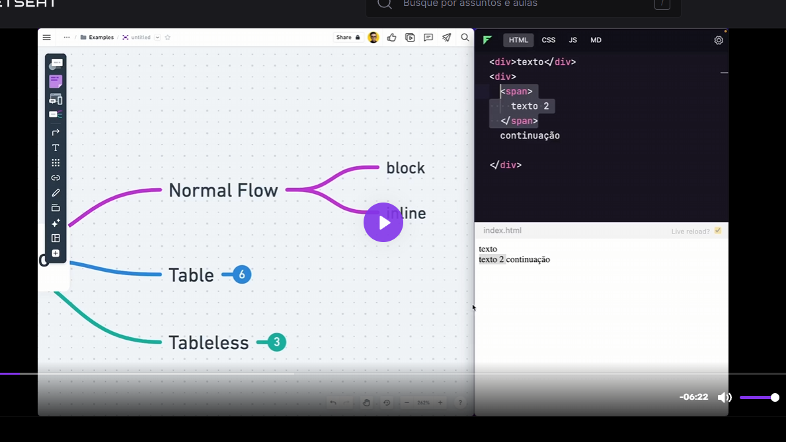
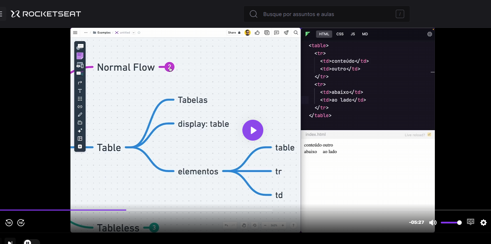
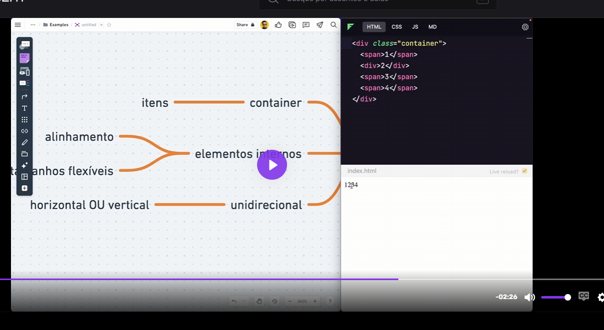
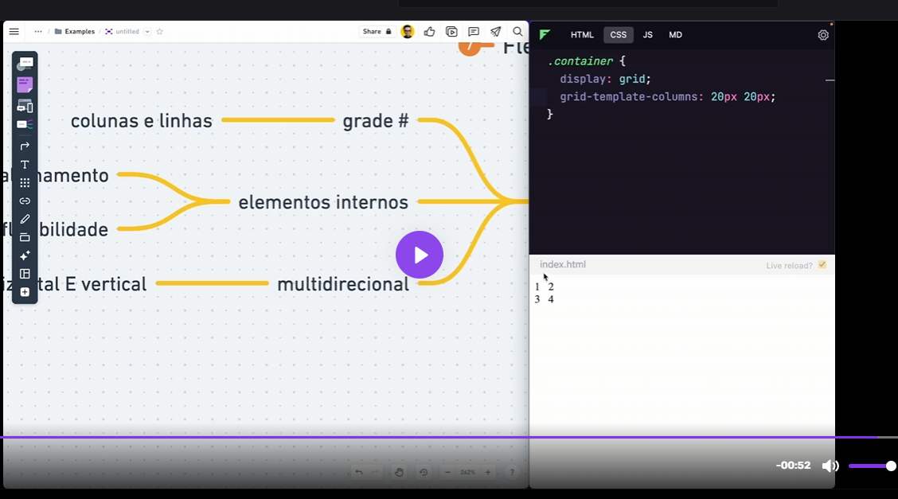
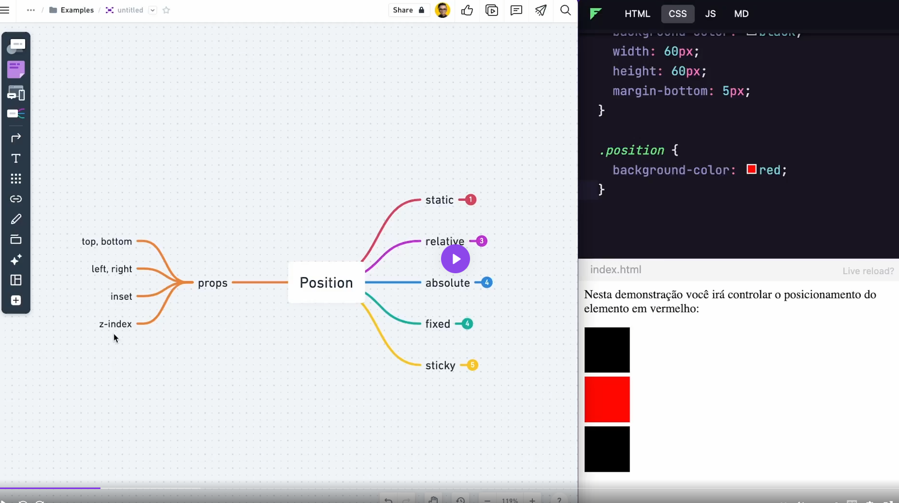
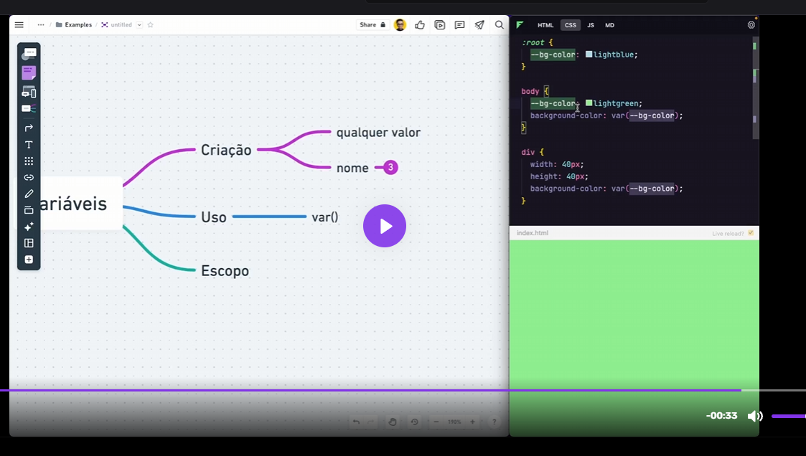
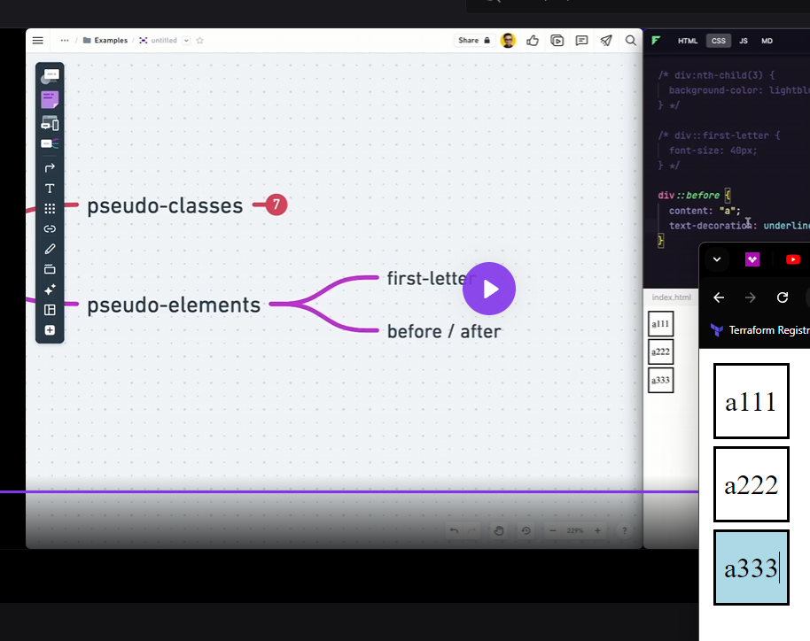

Display: Block (Visualização) -> Usado

Display: Table: -> Não é mais usado

Display Tableless: -> Não é mais usado

Em conjunto:
Flexbox:
 -> É o mais usado hoje em dia
Grid:
 -> É o mais usado hoje em dia

Position:

  position: relative;
    z-index: -1, 0, 1; é a ordem de profundidade do objeto

  position: absolute;
    Não respeita normal flow (top down dos objetos). É um posicionamento fixo na tela/campo de visão.
    bottom: 20px;
    left: 20px;
    z-index: -1;
    Relativo ao containing block próximo ou initial

  position: fixed;
    Fixo na tela, relativo a oinitial containing block. Se der rolagem na tela, ele vai ficar fixo.
    Exemplo: Botão de chat, ou menu superior.

  position: sticky;
    Relativo e fixo. Normal flow. Stacking context.
    Sticky é grudar.
    Relativo ao elemento pai que tenha mecanismo de scroll:
    section {
      position: relative;
      border: 1px solid;
      overflow: scroll;
      height: 100px;
    }

Variáveis:

Pseudo Classes e Pseudo Elements (sudo classes e sudo elements):

Estructural: Aplica o css no child(filho) conforme o index.
  div:nth-child(3){
    background-color: lightblue;
  }

###
Sudo elements:
div::firt-letter {
  font-size: 20px;
}
Trabalha a parte de um elemento. Aqui iria aplicar font 20px na primeira letra dentro das divs.

Befor/After:
Criar antes ou depos um elemento.
